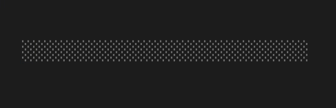

# Progress bar

> `ProgressBar` is an extended version of [`Spinner`](spinner.md), where it's possible to calculate a progress percentage.

[Example code](../examples/progress-bar.py)

## Usage

```python
import threading
import time

from pyinkui import Box, ProgressBar, render
from pyinkcli.hooks import useEffect, useState


def App():
    value, setValue = useState(0)

    def effect():
        stop = threading.Event()

        def worker():
            current = 0
            while current < 100 and not stop.wait(0.05):
                current += 5
                setValue(current)

        thread = threading.Thread(target=worker, daemon=True)
        thread.start()

        def cleanup():
            stop.set()

        return cleanup

    useEffect(effect, ())
    return Box(ProgressBar(value=value), width=20)


if __name__ == '__main__':
    render(App).wait_until_exit()
```



## Props

### value

Type: `number` \
Minimum: `0` \
Maximum: `100` \
Default: `0`

Progress.
