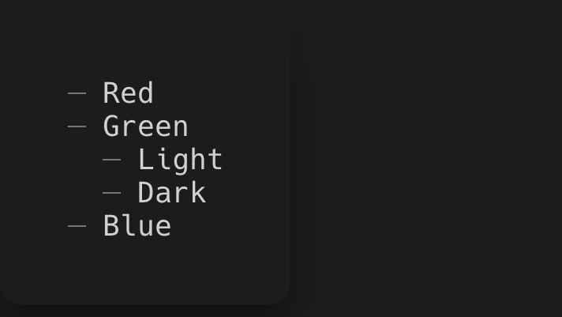

# Unordered list

> `UnorderedList` is used to show lists of items.

[Example code](../examples/unordered-list.py)

## Usage

```python
from pyinkcli import Text, render
from pyinkui import UnorderedList


def App():
    return UnorderedList(
        UnorderedList.Item(Text('Red')),
        UnorderedList.Item(Text('Green')),
        UnorderedList.Item(Text('Blue')),
    )


if __name__ == '__main__':
    render(App).wait_until_exit()
```



## Props

### UnorderedList

#### children

Type: `ReactNode`

List items.

### UnorderedList.Item

#### children

Type: `ReactNode`

List item content.
